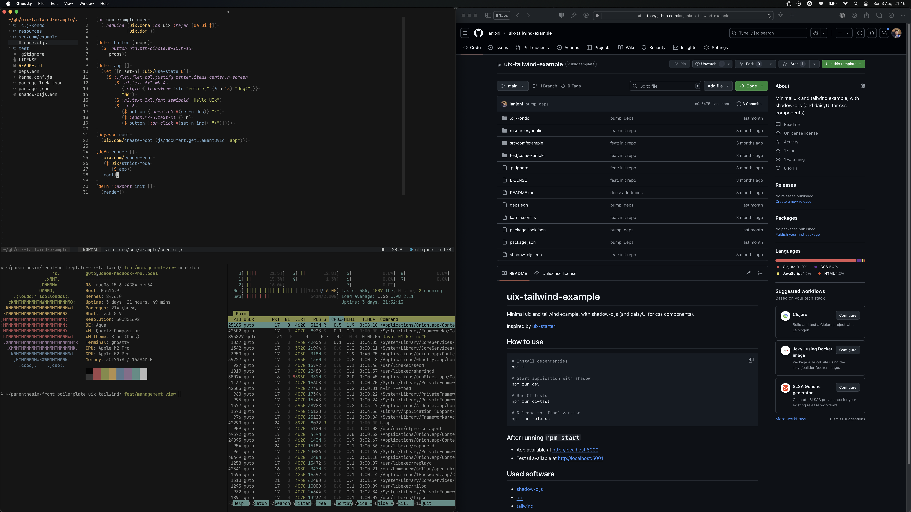

# dotfiles

These are my dotfiles, the *coolest* ones you'll ever see.

> *How my setup looks like currently (macOS + neovim)*

## Config
I have some configurations provided for mac and linux (because I use both), so:
- `artemis`: macbook
- `turing`: desktop with linux (arch)

## Quickstart
- If you're using macOS:
  - Install [Homebrew](https://brew.sh/)
  - Install some Nerd Fonts (Monaco, Fira Code and JetBrains Mono for example)
  - Start using configuration files from `config` and `artemis` directories
- If you're using linux:
  - Install some Nerd Fonts (Monaco, Fira Code and JetBrains Mono for example)
  - Start using configuration files from `config` and `turing` directories
 
### Shell
I'm using [zsh](https://www.zsh.org/) with [Oh My Zsh](https://ohmyz.sh/), so if you want to use it you have to install with `sh -c "$(curl -fsSL https://raw.githubusercontent.com/ohmyzsh/ohmyzsh/master/tools/install.sh)"`.
> Previously I was using [fish](https://fishshell.com/).

## Notable stuff
 - [Nvim configuration with nfnl/fennel](https://github.com/lanjoni/dotfiles/tree/master/config/nvim)
   - [Extensive Documentation about this](https://github.com/rafaeldelboni/cajus-nfnl)

## License
This is free and unencumbered software released into the public domain.  
For more information, please refer to <http://unlicense.org>
